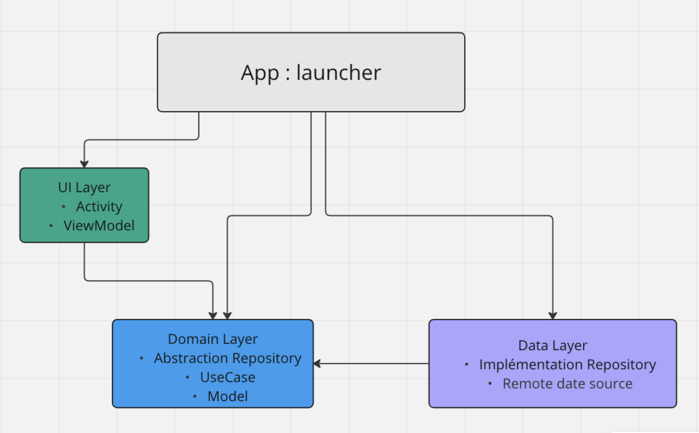

# BookStore

Cette application a été réalisée sur mon temps libre dans le but de monter en compétence sur de nouvelles technologies.

Api open source :  https://openlibrary.org/developers/api

# À propos du développeur

Si vous avez des questions concernant l'application, des bugs à remonter, des suggestions ou
remarques, n'hésitez pas à me contacter sur :

Mail: benabdallahismail121@gmail.com

Linkedin: https://www.linkedin.com/in/baismail

# Architecture & Choix techniques

### Clean Architecture :

Elle réduire les dépendances de logique métier avec les services que l'app consomme (API, Base de
données, Framework, Librairies tierces), et pour maintenir une application stable au cours de ses
évolutions, de ses tests mais également lors de changements ou mises à jour des ressources externes.

### Coroutines Kotlin :

Elle fournissent une API qui vous permez d'écrire du code asynchrone. Avec les coroutines Kotlin,
vous pouvez définir unCoroutineScope qui vous aide à gérer quand vos coroutines doivent s'exécuter.
Chaque opération asynchrone s'exécute dans une thread particulière.

### Hilt :

Hilt est une bibliothèque d'injection de dépendances pour Android qui réduit le passe-partout de l'
injection manuelle de dépendances dans votre projet. L'injection manuelle de dépendances vous oblige
à construire chaque classe et ses dépendances à la main, et à utiliser des conteneurs pour
réutiliser et gérer les dépendances.

### Retrofit :

C'st un client HTTP de type sécurisé pour Android. Retrofit facilite la connexion à un service Web
REST en traduisant l'API en interfaces. Elle est puissante facilite la consommation de données JSON
ou XML, qui sont ensuite analysées en objets. Les requêtes GET, POST, PUT, PATCH et DELETE peuvent
toutes être exécutées. Retrofit utilise #OkHttp (du même développeur) pour gérer les requêtes
réseau. De plus, Retrofit utile le convertisseur #Gson pour analyser les objets JSON.

### UI Compose

Créez de meilleures applications plus rapidement avec Composition du Jetpack Jetpack Compose est la
boîte à outils moderne d'Android pour créer une interface utilisateur native. Il simplifie et
accélère le développement de l'interface utilisateur sur Android. Donnez rapidement vie à votre
application avec moins de code, des outils puissants et des API Kotlin intuitives.

# Android, Architecture Components & jetpack

https://developer.android.com/jetpack/docs/guide

# Open Source Libraries

Kotlin      : https://kotlinlang.org

Gson        : https://github.com/google/gson

Retrofit    : https://square.github.io/retrofit

OkHttp      : https://square.github.io/okhttp

hilt        : https://dagger.dev/hilt/

Coroutines  : https://github.com/Kotlin/kotlinx.coroutines

Paging 3    : https://developer.android.com/topic/libraries/architecture/paging/v3-overview?hl=fr

Compose     : https://developer.android.com/jetpack/compose

# The MIT License

#### Copyright (c) 2024 BENABDALLAH Ismail, https://www.linkedin.com/in/baismail

Permission is hereby granted, free of charge, to any person obtaining a copy of this software and
associated documentation files (the "Software"), to deal in the Software without restriction,
including without limitation the rights to use, copy, modify, merge, publish, distribute,
sublicense, and/or sell copies of the Software, and to permit persons to whom the Software is
furnished to do so, subject to the following conditions:

The above copyright notice and this permission notice shall be included in all copies or substantial
portions of the Software.

THE SOFTWARE IS PROVIDED "AS IS", WITHOUT WARRANTY OF ANY KIND, EXPRESS OR IMPLIED, INCLUDING BUT
NOT LIMITED TO THE WARRANTIES OF MERCHANTABILITY, FITNESS FOR A PARTICULAR PURPOSE AND
NONINFRINGEMENT. IN NO EVENT SHALL THE AUTHORS OR COPYRIGHT HOLDERS BE LIABLE FOR ANY CLAIM, DAMAGES
OR OTHER LIABILITY, WHETHER IN AN ACTION OF CONTRACT, TORT OR OTHERWISE, ARISING FROM, OUT OF OR IN
CONNECTION WITH THE SOFTWARE OR THE USE OR OTHER DEALINGS IN THE SOFTWARE.